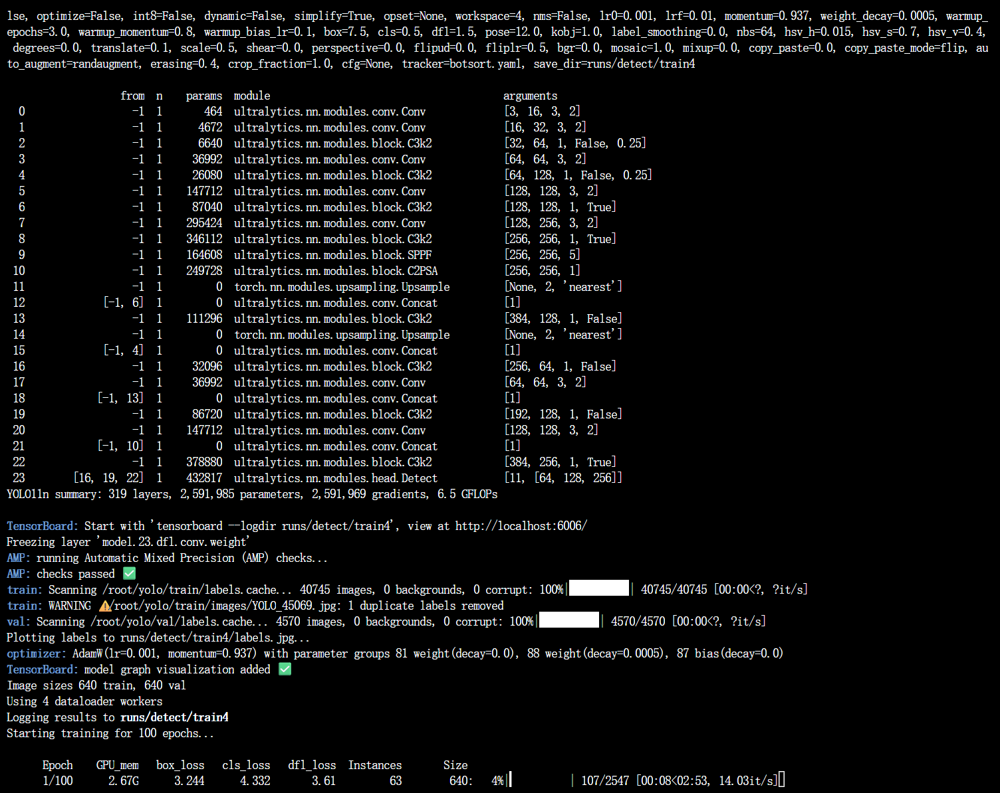
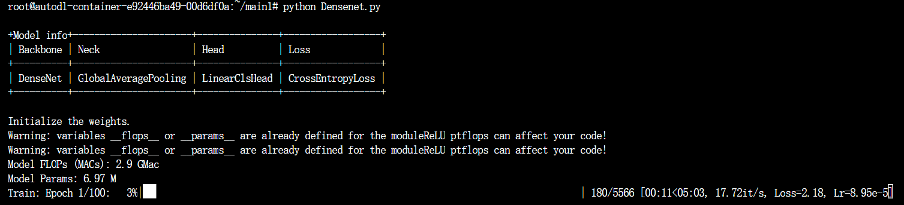
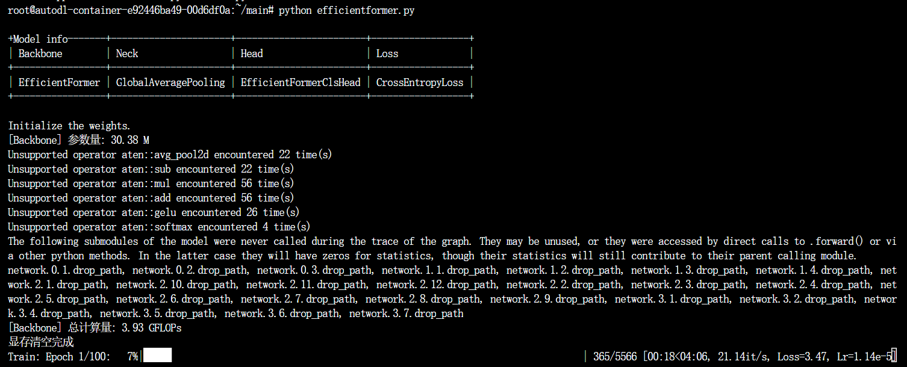

## Обзор：
Моя исследовательская тема — «Распознавание посевов риса на изображениях с помощью методов глубокого обучения». Этот репозиторий на GitHub содержит используемый в исследовании код, включая предобработку данных и реализацию восьми моделей.

Ниже я представлю скриншоты успешного запуска обучения восьми моделей — YOLOv8n, YOLOv11n, YOLOv8n-SE, ResNet-34, SE-ResNet-34, DenseNet-121, DeiT-Tiny (Data-Efficient Image Transformer) и EfficientFormer-L3 — с целью демонстрации подлинности и работоспособности файлов моделей. Затем я объясню назначение основных файлов кода и укажу используемые источники.

## Ниже приведён рисунок, показывающий, что моя модель работает корректно：

Ниже показан YOLOv8n:

Ниже показан YOLOv8n+SE:

Ниже показан YOLOv11n:

Ниже показан Resnet34:

Ниже показан SE-Resnet34:

Ниже показан Densenet:

Ниже показан Deit-tiny:

Ниже показан EfficientFormer-L3:

## Предварительная обработка данных：

**cleanup.py**  
Скрипт для очистки данных и исправления несоответствий между изображениями и метками.

**yolo2coco.py**  
Этот скрипт преобразует разметку YOLO в формат COCO.

**yolo2voc.py**  
Этот скрипт преобразует разметку YOLO в формат VOC.

**check_yolo_labels.py**  
Проверка целостности разметки в наборе данных.

**rename_yolo.py**  
Пакетное переименование изображений и файлов разметки YOLO.

**rename.py**  
Пакетное переименование файлов изображений

**augment_yolo.py**  
Аугментация набора данных YOLO

**crop_imgs.py**  
Обрезка изображений по разметке YOLO

**update_labels.py**  
Изменение меток классов YOLO.

**splite.py**  
Итеративное разделение обучающего и проверочного наборов данных

**splite.py**  
Подсчёт количества объектов по классам.

**compress_imgs.py**  
Сжатие качества изображений.

## YOLO

**yolo/train8.py**  
Код для обучения YOLOv8.

**yolo/train11.py**  
Код для обучения YOLOv11.

**yolo/train8se.py**  
Код для обучения YOLOv8+SE.

**yolo/ultralytics/cfg/models/v8/yolov8.ymal**  
Файл конфигурации модели YOLOv8.

**yolo/ultralytics/cfg/models/v8/SEAtt_yolov8.yaml**  
Файл конфигурации модели YOLOv8+SE.

**yolo/ultralytics/cfg/models/11/yolo11.ymal**  
Файл конфигурации модели YOLOv11.

**yolo/ultralytics/cfg/datasets/crop.yaml**  
Файл конфигурации набора данных YOLO.

**yolo/ultralytics/nn/SEAttention.py**  
Этот файл реализует модуль SE.

**yolo/runs/detect/yolo8**  
Эта папка содержит лог-файлы, результаты оценочных метрик и различные графики, полученные в процессе обучения модели YOLOv8.

**yolo/runs/detect/yolo8se**  
Эта папка содержит лог-файлы, результаты оценочных метрик и различные графики, полученные в процессе обучения модели YOLOv8+SE.

**yolo/runs/detect/yolo11**  
Эта папка содержит лог-файлы, результаты оценочных метрик и различные графики, полученные в процессе обучения модели YOLOv11.

## Основные файлы других моделей

**GetAnnot.py**  
Список данных для набора генерации и тестирования.

**Resnet.py**  
Файл конфигурации обучения модели.

**seresnet.py**  
Файл конфигурации обучения модели

**Densenet.py**  
Файл конфигурации обучения модели

**deit and efficicentformer/deit.py**  
Файл конфигурации обучения модели

**deit and efficicentformer/efficientformer.py**  
Файл конфигурации обучения модели

**datas/annotations.txt**  
Файл сопоставления классов и меток

**datas/train.txt**  
Список данных обучающего набора

**datas/test.txt**  
Список данных тестового набора

**configs/backbones/densenet.py**  
Этот файл представляет собой часть backbone-архитектуры DenseNet.

**configs/backbones/resnet.py**  
Этот файл представляет собой часть backbone-архитектуры ResNet.

**configs/backbones/seresnet.py**  
Этот файл представляет собой часть backbone-архитектуры SE-Resnet.

**deit and efficicentformer/configs/backbones/efficientformer.py**  
Этот файл представляет собой часть backbone-архитектуры Efficientformer.

**deit and efficicentformer/configs/backbones/vision_transformer.py**  
Этот файл представляет собой часть backbone-архитектуры Vision Transformer.

**configs/necks/gap.py**  
Этот файл реализует модуль глобального усредняющего пула (Global Average Pooling).

**deit and efficicentformer/configs/necks/gap.py**  
Этот файл реализует модуль глобального усредняющего пула (Global Average Pooling).

**configs/heads/linear_head.py**  
Этот файл реализует модуль линейной головы классификации (Linear Classification Head).

**deit and efficicentformer/configs/heads/efficientformer_head.py**  
Этот файл реализует модуль Efficientformer Class Head.

**deit and efficicentformer/configs/heads/deit_head.py**  
Этот файл реализует модуль Deit Class Head.

**configs/losses/cross_entropy_loss.py**  
Этот файл реализует модуль функции потерь с перекрестной энтропией (Cross-Entropy Loss).

**deit and efficicentformer/configs/losses/cross_entropy_loss.py**  
Этот файл реализует модуль функции потерь с перекрестной энтропией (Cross-Entropy Loss).

**logs/logs/DenseNet/2025-04-23-01-54-02**  
Эта папка содержит результаты обучения DenseNet: метрики оценки, время обучения, графики функции потерь во время тренировки и валидации.

**logs/logs/ResNet/2025-04-21-15-31-19**  
Эта папка содержит результаты обучения ResNet: метрики оценки, время обучения, графики функции потерь во время тренировки и валидации.

**logs/logs/SEResNet/2025-04-22-13-08-21**  
Эта папка содержит результаты обучения SE-ResNet: метрики оценки, время обучения, графики функции потерь во время тренировки и валидации.

## Ссылка на репозиторий GitHub：
@misc{2023mmpretrain,
    title={OpenMMLab's Pre-training Toolbox and Benchmark},
    author={MMPreTrain Contributors},
    howpublished = {\url{https://github.com/open-mmlab/mmpretrain}},
    year={2025}
}

@misc{ultralytics,
  author       = {Ultralytics},
  title        = {Ultralytics},
  year         = 2024,
  howpublished = {\url{https://github.com/ultralytics/ultralytics}},
  note         = {Accessed: 2024}
}

@misc{Awesome-Backbones,
  author       = {Fafa-DL},
  title        = {Awesome-Backbones},
  year         = 2024,
  howpublished = {\url{https://github.com/Fafa-DL/Awesome-Backbones}},
  note         = {Accessed: 2025}
}
